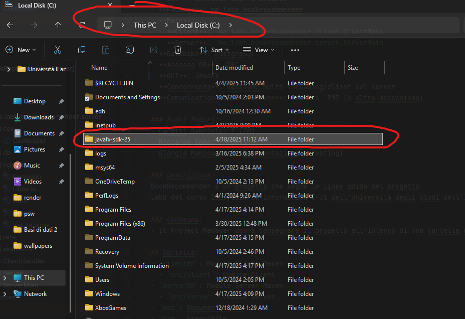
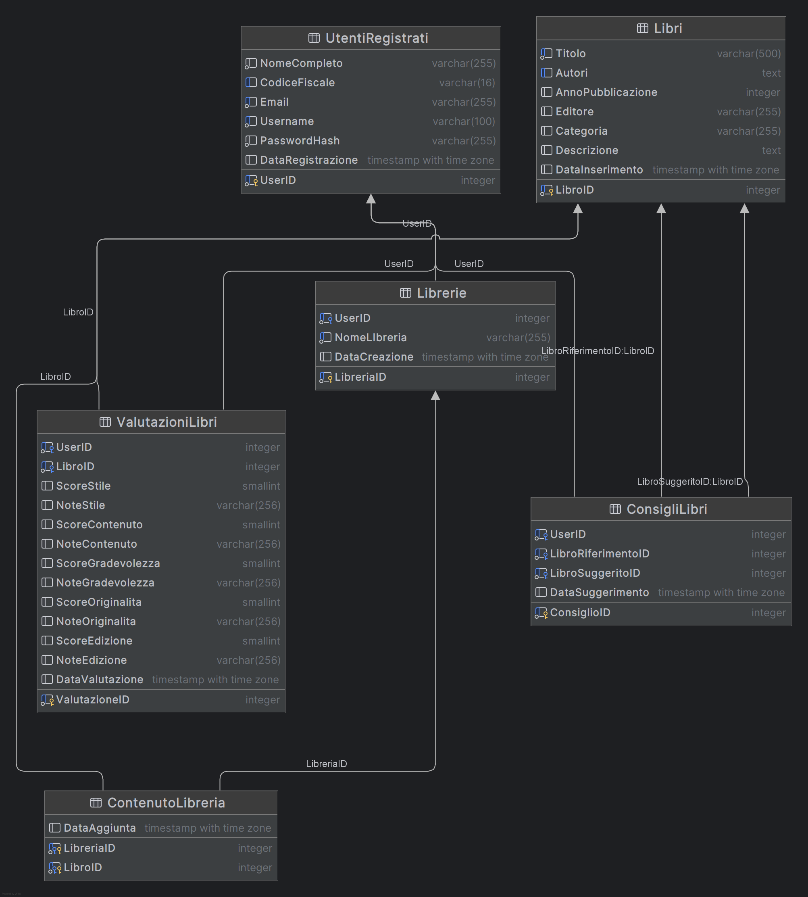

# LabB: BookRecommender

### Membri Gruppo:
- `Caretti Gabriele 756564 VA`
- `Como Riccardo 758697 VA`
- `Manicone Giorgia 758716 VA`

### Informazioni:
- **Java**: 24
- **Package Manager**: Maven
- **IDE**: IntelliJ IDEA & Eclipse
- **Package**: me.labb.bookrecommender
- **Main**:
  - **Client**: `me.labb.bookrecommender.client.ClientMain`
  - **Server**: `me.labb.bookrecommender.server.ServerMain`
- **Database**: PostgreSQL
- **Accesso DB**: JDBC
- **GUI**: JavaFX
- **Concorrenza**: Gestione multi-threading/client sul server (ClientHandler)
- **Comunicazione Client/Server**: Sockets (Con serializzazione JSON)

### Ruoli Membri:
- Caretti Gabriele: (PM & Dev client e server)
- Riccardo Como: (Dev client e server)
- Giorgia Manicone: (Documentazione e Testing)

### Descrizione:
BookRecommender è un progetto che segue le linee guida del progetto
LabB del corso 2023/2024 di Informatica L-31 dell'Università degli Studi dell'Insubria.

### Consegna:
- Il Project Manager dovrà consegnare il progetto all'interno di una cartella compressa denominata con cognome_matricola, caricata su OneDrive dell'Università o Google Drive, condividendo il link.

## Cartelle:
- `clientBR`: Modulo Client Maven
  - `src/client`: Codice Client
- `serverBR`: Modulo Server Maven
  - `src/server`: Codice Server
- `doc`: Documentazione
- `bin`: Eseguibile
- `data`: File dati
- `in caso di errore`: installare JavaFX 25-ea+1 e posizionare la cartella nel disco C://. Download : "https://gluonhq.com/products/javafx/" 

## Connessione al Database:
- Farsi passare il `config.properties` chiedendolo, e inserirlo in serverBR/src/main/resources

## Schema Database (PostgreSQL):



```sql
CREATE TABLE UtentiRegistrati (
    UserID SERIAL PRIMARY KEY,
    NomeCompleto VARCHAR(255) NOT NULL,
    CodiceFiscale VARCHAR(16) UNIQUE,
    Email VARCHAR(255) UNIQUE NOT NULL,
    Username VARCHAR(100) UNIQUE NOT NULL,
    PasswordHash VARCHAR(255) NOT NULL,
    DataRegistrazione TIMESTAMP WITH TIME ZONE DEFAULT CURRENT_TIMESTAMP
);

CREATE TABLE Libri (
    LibroID SERIAL PRIMARY KEY,
    Titolo VARCHAR(500) NOT NULL,
    Autori TEXT,
    MesePubblicazione VARCHAR(9) CHECK (MesePubblicazione IN ('January', 'February', 'March', 'April', 'May', 'June', 'July', 'August', 'September', 'October', 'November', 'December')),
    AnnoPubblicazione INTEGER,
    Editore VARCHAR(255),
    Categoria VARCHAR(255),
    Descrizione TEXT,
    Prezzo NUMERIC(6,2) DEFAULT 0,
    DataInserimento TIMESTAMP WITH TIME ZONE DEFAULT CURRENT_TIMESTAMP
);

CREATE TABLE Librerie (
    LibreriaID SERIAL PRIMARY KEY,
    UserID INTEGER NOT NULL REFERENCES UtentiRegistrati(UserID) ON DELETE CASCADE,
    NomeLibreria VARCHAR(255) NOT NULL,
    DataCreazione TIMESTAMP WITH TIME ZONE DEFAULT CURRENT_TIMESTAMP,
    UNIQUE(UserID, NomeLibreria)
);

CREATE TABLE ContenutoLibreria (
    LibreriaID INTEGER NOT NULL REFERENCES Librerie(LibreriaID) ON DELETE CASCADE,
    LibroID INTEGER NOT NULL REFERENCES Libri(LibroID) ON DELETE CASCADE,
    DataAggiunta TIMESTAMP WITH TIME ZONE DEFAULT CURRENT_TIMESTAMP,
    PRIMARY KEY (LibreriaID, LibroID)
);

CREATE TABLE ValutazioniLibri (
    ValutazioneID SERIAL PRIMARY KEY,
    UserID INTEGER NOT NULL REFERENCES UtentiRegistrati(UserID) ON DELETE CASCADE,
    LibroID INTEGER NOT NULL REFERENCES Libri(LibroID) ON DELETE CASCADE,
    ScoreStile SMALLINT CHECK (ScoreStile >= 1 AND ScoreStile <= 5),
    NoteStile VARCHAR(256),
    ScoreContenuto SMALLINT CHECK (ScoreContenuto >= 1 AND ScoreContenuto <= 5),
    NoteContenuto VARCHAR(256),
    ScoreGradevolezza SMALLINT CHECK (ScoreGradevolezza >= 1 AND ScoreGradevolezza <= 5),
    NoteGradevolezza VARCHAR(256),
    ScoreOriginalita SMALLINT CHECK (ScoreOriginalita >= 1 AND ScoreOriginalita <= 5),
    NoteOriginalita VARCHAR(256),
    ScoreEdizione SMALLINT CHECK (ScoreEdizione >= 1 AND ScoreEdizione <= 5),
    NoteEdizione VARCHAR(256),
    DataValutazione TIMESTAMP WITH TIME ZONE DEFAULT CURRENT_TIMESTAMP,
    UNIQUE(UserID, LibroID)
);

CREATE TABLE ConsigliLibri (
    ConsiglioID SERIAL PRIMARY KEY,
    UserID INTEGER NOT NULL REFERENCES UtentiRegistrati(UserID) ON DELETE CASCADE,
    LibroRiferimentoID INTEGER NOT NULL REFERENCES Libri(LibroID) ON DELETE CASCADE,
    LibroSuggeritoID INTEGER NOT NULL REFERENCES Libri(LibroID) ON DELETE CASCADE,
    DataSuggerimento TIMESTAMP WITH TIME ZONE DEFAULT CURRENT_TIMESTAMP,
    UNIQUE(UserID, LibroRiferimentoID, LibroSuggeritoID),
    CHECK (LibroRiferimentoID <> LibroSuggeritoID)
);

-- INDICI
CREATE INDEX idx_libri_titolo ON Libri (Titolo);
CREATE INDEX idx_libri_autori ON Libri (Autori);
CREATE INDEX idx_valutazioni_libro ON ValutazioniLibri (LibroID);
CREATE INDEX idx_consigli_riferimento ON ConsigliLibri (LibroRiferimentoID);
CREATE INDEX idx_contenuto_libreria_utente ON ContenutoLibreria (LibreriaID);
```

## Installazione (e sviluppo):
Assicurarsi di avere Java JDK 24 e JRE all'ultima versione, e maven installato.

- Inserire in `serverBR/src/main//resources` il file `config.properties` con le credenziali di accesso al database:
```properties
db.url=jdbc:postgresql://indirizzo:5432/postgres
db.username=postgres
db.password=passwordaldb
server.port=8080
```
- Caricare il progetto tramite `pom.xml` nella root del progetto.
- Avviare `mvn clean install` (o se si sta usando Intellij Idea, premere su "m" nella colonna a destra, aprire BookRecommender -> Lifecycle -> Cliccare due volte `clean`, attendere, e successivamente anche `install`).
- Avviare il server su Intellij Idea, aprendo `serverBR/src/main/java/me.labb.bookrecommender.server/ServerMain` e premendo il tasto run verde a sinistra del `public class ServerMain {`.
- Avviare il client tramite `mvn javafx:run -f pom.xml` (o, con Intellij Idea premer su "m" nella colonna a destra, aprire BookRecommender-Client->Plugins->javafx-> Cliccare due volte javafx:run).

Possono capire errore, i più comuni sono dovuto ad un conflitto di versioni Java installate. Per sicurezza, disinstallare qualsiasi altra versione di java
dalla macchina e installare solamente il JDK 24, e se proprio servisse, un JRE ultima versione (non il vecchio 1.8).

## Build
- `mvn clean install` creerà un jar sia nel serverBR/target, che nel clientBR/target, entrambi avviabili tramite `java -jar nomejar.jar`.
  (Da Intellij Idea, premere sulla "m" ed entrare in BookRecommender -> Lifecycle -> Click due volte su clean e poi install).

## Avvio server e client:
- Avviare prima il server tramite l'apposito .jar.
- Avviare il client tramite l'apposito .jar.

In caso di errori, potrebbe essere necessario il file `config.properties` con le credenziali per accedere al database postgres da parte del server.
