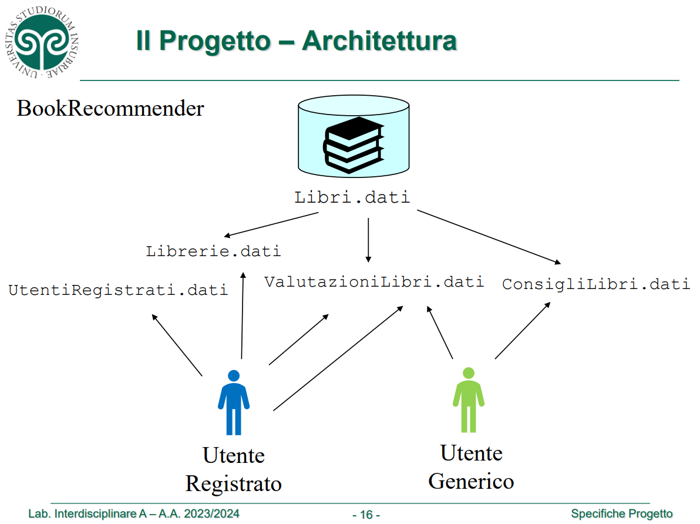

# LabA: Book Recommender

### Membri Gruppo:
- `Caretti Gabriele 756564 VA`
- `Como Riccardo 758697 VA`
- `Manicone Giorgia 758716 VA`

### Informazioni:
- Java 24
- **Package Manager**: Maven
- **IDE**: IntelliJ IDEA & Eclipse
- **Package**: me.labb.bookrecommender
- **Main**: TBD

### Ruoli Membri:
- Caretti Gabriele: ? (PM)
- Riccardo Como: ? (Dev)
- Giorgia Manicone: ? (Documentazione e Testing)

### Descrizione:
Book Recommender è un progetto che segue le linee guida del progetto
LabB del corso 2023/2024 di Informatica L-31 dell'Università degli Studi dell'Insubria.

### Consegna:
- Il Project Manager dovrà consegnare il progetto all'interno di una cartella compressa denominata con cognome_matricola, caricata su OneDrive dell'Università o Google Drive, condividendo il link.

## Cartelle:
- Principali: 
  - `LabA`
  - `LabB`
- SubCartelle:
  - `doc`: Documentazione
  - `src`: Codice sorgente
  - `bin`: Eseguibile
  - `data`: File dati
  - (eg: `serverBR` e `clientBR`): eventuali moduli

## Architettura:
